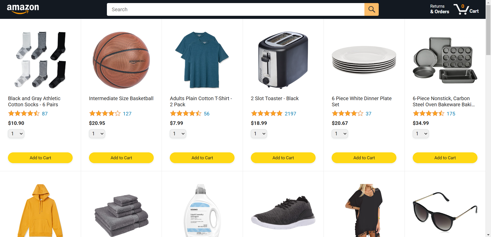
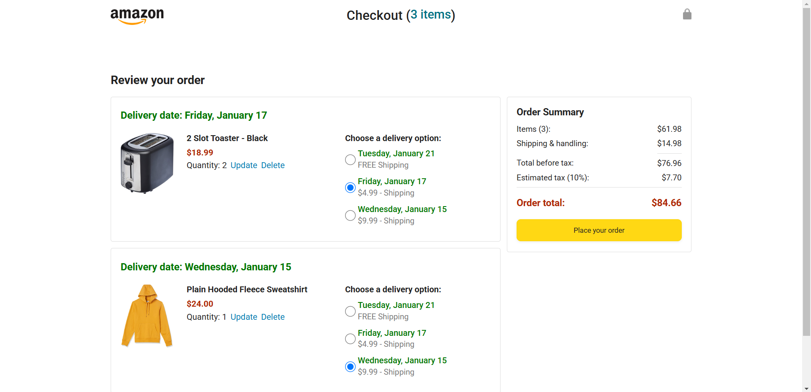

# Amazon Clone

This project is an Amazon clone built using JavaScript. It replicates key functionalities of an e-commerce platform and serves as a practice ground for core programming concepts and DOM manipulation.



## Features
- Dynamic content rendering using **DOM manipulation**
- Implementation of **variables**, **objects**, **arrays**, and **if statements** for business logic
- Efficient looping mechanisms with **loops** and **arrow functions**
- Organized codebase using **modules**
- Integration of **external libraries** for enhanced functionality
- Asynchronous programming with **callbacks** and **async/await**
- Interactive **payment section** with live shipment and price updates
  


## Tech Stack
- **HTML**: Markup structure
- **CSS**: Styling
- **JavaScript**: Logic and interactivity

## What I Learned
- Using **variables**, **objects**, and **arrays** to structure data
- Writing conditional logic with **if statements**
- Manipulating the DOM to dynamically update content
- Iterating over data efficiently with **loops**
- Simplifying function definitions using **arrow functions**
- Modularizing code for reusability and clarity
- Leveraging **external libraries** to extend application capabilities
- Managing asynchronous operations with **callbacks** and **async/await**
- Building interactive features such as the **payment/checkout section**

## How to Run the Project
1. Clone the repository:
   ```bash
   git clone <repository-url>
   ```
2. Navigate to the project folder:
   ```bash
   cd amazon-clone
   ```
3. Open `index.html` in your browser with live server to view the application.

---
